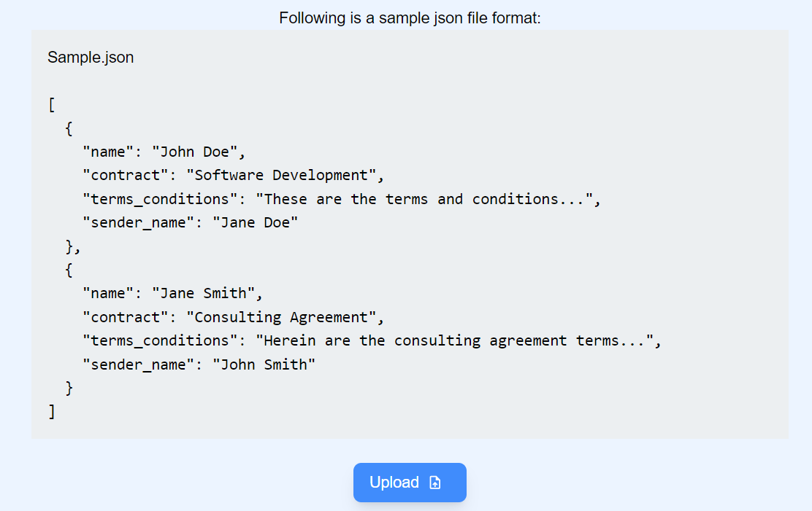
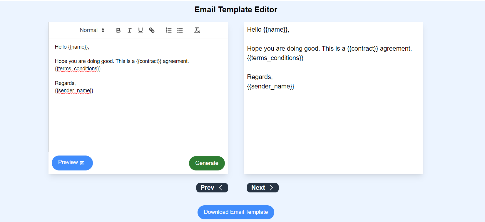
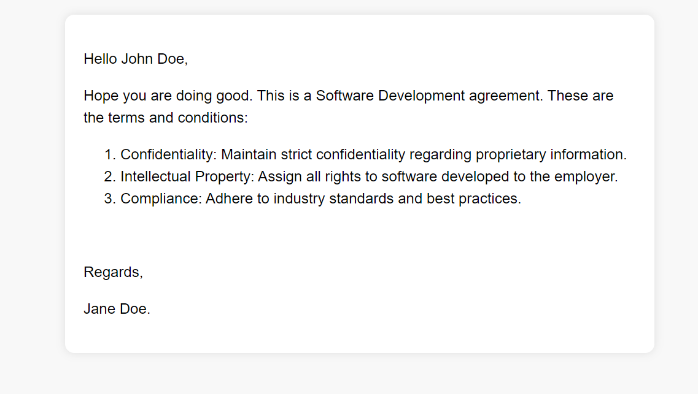

# Personalized_Email_Campaign_Tool
The Personalized Email Campaign Tool simplifies the creation of multiple personalized email templates simultaneously, offering an intuitive user experience. With its user-friendly interface and efficient features, this tool empowers users to effortlessly create and customize personalized email campaigns with ease and efficiency.

## Features
1. Upload a JSON file containing parameters that require customization for each template.


2. With the ReactQuill rich text editor, effortlessly tailor your templates, crosscheck their format in adjacent read-only mode, switch to preview mode with a template layout, and generate templates for the JSON list by clicking **"Generate"**. After Clicking Generate, click on **"Next"** and **"Prev"** to go through the templates [**Note**: While creating a template, use "{{parameter}}" format for all the parameters which needs to be altered in individual template.(ex:{{name}})] 


3. You can also save the template format by clicking on download button, which gives you .html file of the email template.


## SetUp
This tool is built using React and Tailwind CSS.
Make sure to install the following dependencies:
```
react-router-dom
react-quill
react-icons

```
**or** simply use:
```
cd frontend
npm i
```
To set up Tailwind CSS, install the package and customize the configuration in the tailwind.config.js file as needed.
For installation
```
cd frontend
npm install -D tailwindcss
npx tailwindcss init
```
Modify the tailwind.config.js file as given in [Tailwind Config File](frontend/tailwind.config.js) 

Run the app:
```
cd frontend
npm start
```


